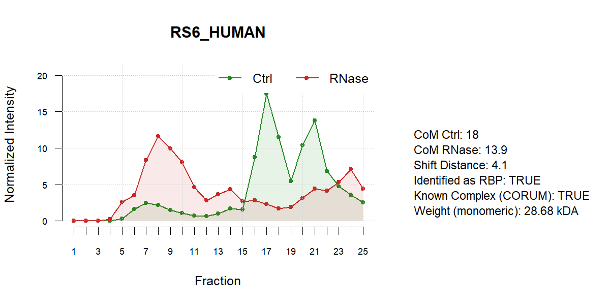
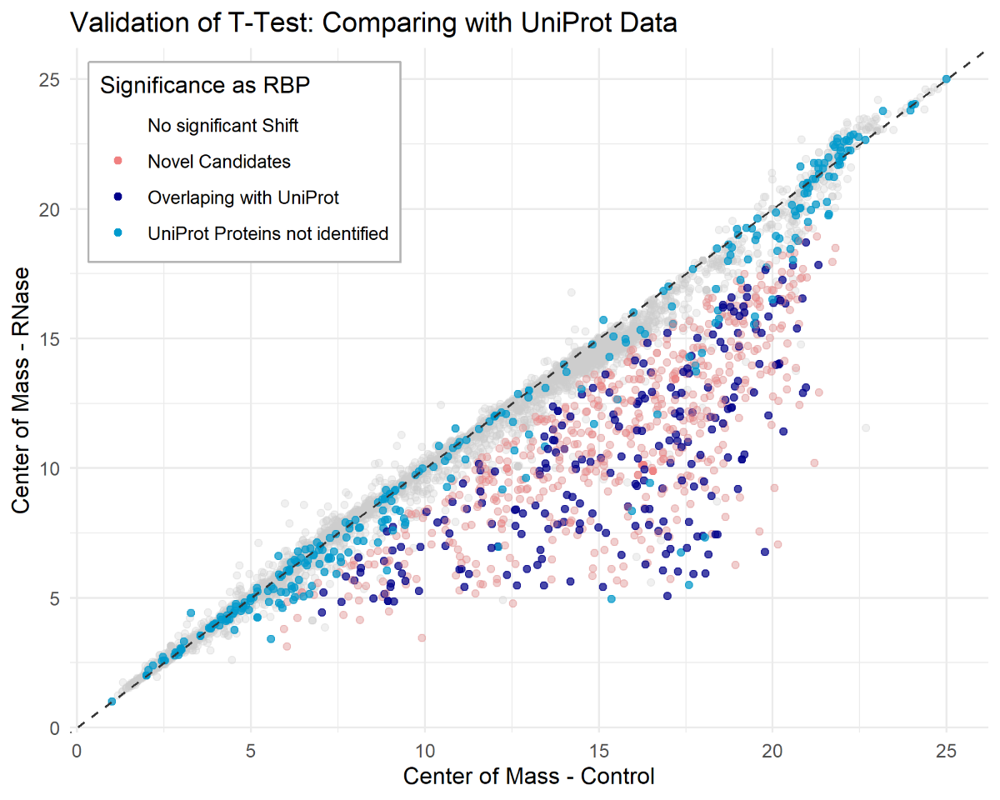

# 2025-topic-03-group-02
# 🧬 Proteome-wide Screen for RNA-dependent Proteins of HeLa cells synchronized in mitosis

## **Introduction** 
Welcome to our quest to follow a protein on its journey, where it searches for its friends and family, while it adapts and learns new things about itself.
### Introduction to RNA Binding Proteins – Spoiler alert!:
RNA-binding proteins (RBPs) are essential regulators of gene expression, controlling everything from splicing and localization to translation and degradation of RNA. RBPs are dynamic players whose behavior can change dramatically depending on the cell’s current “season.”
During the cell cycle, and especially in the high-stakes phase of mitosis, RBPs undergo striking redistributions and functional shifts. Some vanish into the background, while others emerge as key orchestrators of the mitotic program, helping the cell divide its internal world with precision.
By exploring how RBP activity and localization change during mitosis, we uncover clues to how cells coordinate this tightly regulated process — and perhaps, how dysregulation leads to disease. This project dives deep into the shifting world of RBPs in mitosis. 
### Introduction to Our Data
All proteins originate from mass spectrometry data of HeLa cells in mitosis.

    Total number of proteins:7159

    Number of fractions: 25

    Number of replicates per protein: 3
### Overview of Goals

**RNA-dependent Proteins**
The first goal of our pipeline was to develop a method to determine, as reliably as possible, whether a protein is an RBP or not. We approached this by comparing the two experimental conditions under which the proteins were analyzed: Ctrl and RNase. By characterizing the change—or shift—in protein distribution, we identified RNA-dependent proteins.

**RNA-dependent Proteins Active in Mitosis**
Our second goal was to take advantage of our specific dataset from synchronized HeLa cells in mitosis. Using the results from the first step, we applied the same pipeline to the synchronized dataset. We then overlaid both results and extracted all proteins that, according to our logic, should only be active in mitosis—i.e., proteins that exhibited RBP-like behavior exclusively during mitosis.

**Complex Finding**
As our third goal, we aimed to deepen our analysis by identifying protein clusters and determining whether they could represent potential RBP-dependent complexes active in mitosis. To help interpret these findings, we compared our predicted complexes with known complexes from the CORUM database.

**Molecular Weight Prediction**
Finally, we explored whether our data could support other types of predictions beyond RBPs. Specifically, we investigated whether the sucrose gradient (i.e., the positions of the fractions) correlates with molecular weight.

## **Results**

### Who is RiboSix?
Among the 7159 proteins, one protein stood out: RS6_HUMAN, 
affectionately nicknamed RiboSix. What makes RiboSix special is not just its clear 
RNA dependence, but its specificity. It is only active during mitosis, suggesting 
a tightly regulated, phase-specific function. Further analysis revealed that RiboSix 
clusters with other RNA-dependent proteins into a known complex, reinforcing its 
functional relevance.
In the following sections, we describe the methods and results that led us to uncover 
RiboSix’s identity, its activity pattern, and its molecular connections.
> 
**Fig. 1: Intensity profile of RS6_HUMAN across 25 fractions.**
Normalized intensities across control and RNase treatment reveal a clear leftward 
shift in elution after RNase treatment, indicative of RNA-dependent behavior. 
Additional panel summarizes shift distance, complex membership (CORUM), and molecular weight.

### Identification of RNA-dependent proteins 
To detect RNA-dependent behavior, proteins were classified as RNA-binding candidates 
if their center of mass (CoM) shifted more than one fraction toward the top of 
the gradient upon RNase treatment. This shift indicates loss of RNA interactions 
that otherwise stabilize their complex or position in the gradient.
The resulting list of RNA-dependent proteins was then cross-referenced with UniProt 
annotations to evaluate how many of them were already known and how many may represent novel candidates.

**Total RNA-dependent proteins identified: 794** 

**Validated by UniProt annotation: 230**

**Novel RNA-binding candidates: 564**

> 
**Fig. 2: Validation of RNA-dependence by T-Test using UniProt annotation.**
Scatterplot comparing Center of Mass (CoM) values between control and RNase-treated 
samples for all proteins. Each point represents one protein, color-coded by RNA-binding 
significance: proteins overlapping with UniProt RBPs (dark blue), novel RNA-dependent candidates 
identified by T-Test (light red), UniProt RBPs not detected as significant (cyan), and non-significant 
proteins (grey). The dashed diagonal line marks equal CoM values, with leftward deviation indicating 
RNA-dependent shift behavior. This visualization highlights both confirmed and potentially novel RBPs.

### Identification of mitosis specific proteins 
To assess whether RNA-binding activity was specific to the mitotic phase, the same 
shift-based analysis was applied to non-synchronized HeLa cells. Shift profiles 
were then compared between conditions. Proteins that showed a significant shift 
only during mitosis, but not in the non-synchronized state, were considered mitosis-specific 
RNA-dependent proteins. 

**RBPs uniquely active in mitosis: 237**
> 
**Fig. 3: Comparative Shift Scatterplot (Mitosis vs. Non-Synchronized).**
Scatterplot displays shift distances derived from center of mass (CoM) 
values for all proteins under both conditions. Each point represents one protein, 
color-coded by statistical significance. The red dashed identity line marks equal 
shift behavior; proteins below the line show mitosis-specific leftward shifts, suggesting 
RNA dependency unique to mitosis.

### Discovery of Complexes among mitosis-specific RBPs
To explore whether these RBPs act in shared complexes, density-based clustering 
(DBSCAN) was performed using shift and peak features. Known complexes such as the 
40S ribosomal subunit and the Nop56p-associated pre-rRNA complex served as validation benchmarks (Hayano et al.,2003).

**Proteins from 40S complex clustered together: 3/4**

**Proteins from Nop56p complex clustered together: 4/9**

**Proteins in relevant cluster (Cluster 4): 13**

### Predicting Molecular Weight
It was hypothesized that shift behavior might correlate with molecular weight due 
to sedimentation properties. However, linear regression between RNase-shift-based 
elution profiles and known molecular weights showed no significant relationship.

**Spearman correlation (peak position vs. MW): 0.014**

**R² of linear regression: 0.00017 (p = 0.25)**

## Repository 
1. **Main Analysis Code**  
The main part of the project, the code, can be found under "2025-topic-03-group-02-code_final.Rmd".
> Note: The code was partially written with AI assistance using ChatGPT 4.o.

2. **Datasets**  
All used datasets are stored in the folder called "datasets". It includes:  
   a) RDeeP_HeLa_Mitosis.csv --> the initial Proteomic dataset of HeLa cells synchronized in mitosis.  
   b) RDeeP_HeLa_NS.csv --> the dataset from non-synchronized HeLa cells, used to filter out RBPs that are not mitosis-specific.
   
3. **Reference Databases**  
All external reference data can be found in the folder "databanks". It includes:   
   a) uniprotkb_KW_0694_AND_model_organism_96_2025_07_04.tsv --> A list of annotated RBPs from UniProt.  
   b) corum_humanComplexes --> Known human protein complexes used to validate clustering results. 
   
4. **Unused Code**  
Throughout the project, various approaches and analyses were tested. While not all made it into the final pipeline, it should not go to waste.
All of the parts that did not make it, can be found in the rmd.file called "Unused Code Chunks".

5. **Reference Paper**  
To benchmark our clustering results, we used a publication by Hayano et al., which describes the composition of the 
Nop56p-associated pre-rRNA processing complex in human cells. It is saved as "Paper_Nop56p".
   
6. **Poster**  
The poster to present all the findings is titled "2025-topic-03-group-02-poster.pdf" and will be presented on Thursday, July 10th, 2025.

7. **This README**  
Not be left out, this "README.md" file is also part of the Repository. 

8. **Images**  
As is the folder called "Images" containing all the images used in this README.

# 📚 References

### Reviews
- [Hayano et al., Proteomic analysis of human Nop56p-associated pre-ribosomal ribonucleoprotein complexes. Possible link between Nop56p and the nucleolar protein treacle responsible for Treacher Collins syndrome, 2003, Journal of biological chemistry.pdf](Paper_Nop56p.pdf)
- [Sternburg et al., Global Approaches in Studying RNA-Binding Protein Interaction Networks, 2020, Trends in Biochemical Sciences.pdf](https://github.com/user-attachments/files/19981693/Sternburg.et.al.Global.Approaches.in.Studying.RNA-Binding.Protein.Interaction.Networks.2020.Trends.in.Biochemical.Sciences.pdf)
- [Corley et al., How RNA-Binding Proteins Interact with RNA Molecules and Mechanisms, 2020, Molecular Cell.pdf](https://github.com/user-attachments/files/19981705/Corley.et.al.How.RNA-Binding.Proteins.Interact.with.RNA.Molecules.and.Mechanisms.2020.Molecular.Cell.pdf)
- [Gebauer et al., RNA-binding proteins in human genetic disease, 2020, Nature Reviews Genetics.pdf](https://github.com/user-attachments/files/19981707/Gebauer.et.al.RNA-binding.proteins.in.human.genetic.disease.2020.Nature.Reviews.Genetics.pdf)

### Experimental methods
- [Caudron-Herger et al., R-DeeP Proteome-wide and Quantitative Identification of RNA-Dependent Proteins by Density Gradient Ultracentrifugation, 2019, Molecular Cell.pdf](https://github.com/user-attachments/files/19981712/Caudron-Herger.et.al.R-DeeP.Proteome-wide.and.Quantitative.Identification.of.RNA-Dependent.Proteins.by.Density.Gradient.Ultracentrifugation.2019.Molecular.Cell.pdf)
- [Caudron-Herger-Identification, quantification and bioinformatic analysis of RNA-dependent proteins by RNase treatment and density gradient ultracentrifugation using R-DeeP-2020-Nature Protocols_1.pdf](https://github.com/user-attachments/files/19981715/Caudron-Herger-Identification.quantification.and.bioinformatic.analysis.of.RNA-dependent.proteins.by.RNase.treatment.and.density.gradient.ultracentrifugation.using.R-DeeP-2020-Nature.Protocols_1.pdf)
- [Rajagopal-Proteome-Wide Identification of RNA-Dependent Proteins in Lung Cancer Cells-2022-Cancers.pdf](https://github.com/user-attachments/files/19981723/Rajagopal-Proteome-Wide.Identification.of.RNA-Dependent.Proteins.in.Lung.Cancer.Cells-2022-Cancers.pdf)
- [Rajagopal et al., An atlas of RNA-dependent proteins in cell division reveals the riboregulation of mitotic protein-protein interactions. Nat. Commun. 16, 2325 (2025).pdf](https://github.com/user-attachments/files/19981728/Rajagopal.et.al.An.atlas.of.RNA-dependent.proteins.in.cell.division.reveals.the.riboregulation.of.mitotic.protein-protein.interactions.Nat.Commun.16.2325.2025.pdf)
