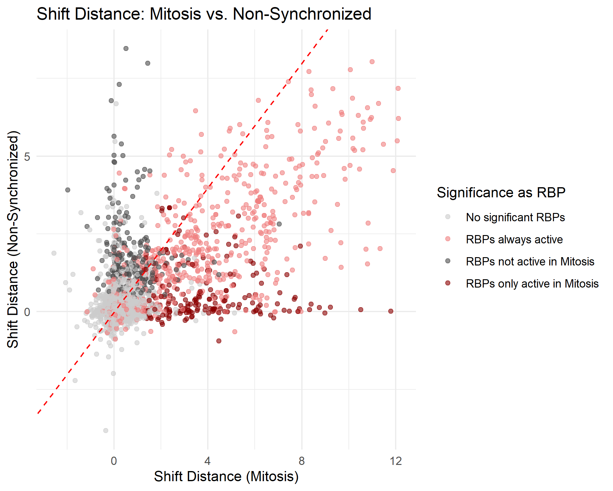

# 2025-topic-03-group-02
# 🧬 Proteome-wide Screen for RNA-dependent Proteins

Welcome to the **Proteome-wide Screen for RNA-dependent Proteins** project! This repository will serve as the central place for exploring, analyzing, and visualizing data related to RNA-protein interactions across the proteome.

# Introduction 

# Results

## Who is RiboSix?
RS6_Human or as we call it RiboSix is one of the RNA-dependent proteins we identified.
What makes it so unique is that is only active during mitosis and works in a complexe 
with other RNA-dependent proteins. How we found that out, is described in the following. 

## Identification of RNA-dependent proteins 
To detect RNA-dependent behavior, proteins were classified as RNA-binding candidates 
if their center of mass (CoM) shifted more than one fraction toward the top of 
the gradient upon RNase treatment. This shift indicates loss of RNA interactions 
that otherwise stabilize their complex or position in the gradient.
The resulting list of RNA-dependent proteins was then cross-referenced with UniProt 
annotations to evaluate how many of them were already known and how many may represent novel candidates.
> Total RNA-dependent proteins identified: 794
Validated by UniProt annotation: 230
Novel RNA-binding candidates: 564

## Identification of mitosis specific proteins 
To assess whether RNA-binding activity was specific to the mitotic phase, the same 
shift-based analysis was applied to non-synchronized HeLa cells. Shift profiles 
were then compared between conditions. Proteins that showed a significant shift 
only during mitosis, but not in the non-synchronized state, were considered mitosis-specific 
RNA-dependent proteins. 
> RBPs uniquely active in mitosis: 237

## Finding Complexes of mitotic RBPs
To explore whether these RBPs act in shared complexes, density-based clustering 
(DBSCAN) was performed using shift and peak features. Known complexes such as the 
40S ribosomal subunit and the Nop56p-associated pre-rRNA complex served as validation benchmarks.
> Proteins from 40S complex clustered together: 3/4
Proteins from Nop56p complex clustered together: 4/9
Proteins in relevant cluster (Cluster 4): 13

## Predicting Molecular Weight
It was hypothesized that shift behavior might correlate with molecular weight due 
to sedimentation properties. However, linear regression between RNase-shift-based 
elution profiles and known molecular weights showed no significant relationship.
> Spearman correlation (peak position vs. MW): 0.014
R² of linear regression: 0.00017 (p = 0.25)

# Was here before (delete when finished the Readme)
> ⚠️ _Note: This README is a starting template. Please update it as your project evolves._
>
For inspiration on writing a comprehensive and engaging README, check out the [Awesome README](https://github.com/matiassingers/awesome-readme?tab=readme-ov-file) repository.

# 📚 Papers

# Reviews
- [Sternburg et al., Global Approaches in Studying RNA-Binding Protein Interaction Networks, 2020, Trends in Biochemical Sciences.pdf](https://github.com/user-attachments/files/19981693/Sternburg.et.al.Global.Approaches.in.Studying.RNA-Binding.Protein.Interaction.Networks.2020.Trends.in.Biochemical.Sciences.pdf)
- [Corley et al., How RNA-Binding Proteins Interact with RNA Molecules and Mechanisms, 2020, Molecular Cell.pdf](https://github.com/user-attachments/files/19981705/Corley.et.al.How.RNA-Binding.Proteins.Interact.with.RNA.Molecules.and.Mechanisms.2020.Molecular.Cell.pdf)
- [Gebauer et al., RNA-binding proteins in human genetic disease, 2020, Nature Reviews Genetics.pdf](https://github.com/user-attachments/files/19981707/Gebauer.et.al.RNA-binding.proteins.in.human.genetic.disease.2020.Nature.Reviews.Genetics.pdf)

# Experimental methods
- [Caudron-Herger et al., R-DeeP Proteome-wide and Quantitative Identification of RNA-Dependent Proteins by Density Gradient Ultracentrifugation, 2019, Molecular Cell.pdf](https://github.com/user-attachments/files/19981712/Caudron-Herger.et.al.R-DeeP.Proteome-wide.and.Quantitative.Identification.of.RNA-Dependent.Proteins.by.Density.Gradient.Ultracentrifugation.2019.Molecular.Cell.pdf)
- [Caudron-Herger-Identification, quantification and bioinformatic analysis of RNA-dependent proteins by RNase treatment and density gradient ultracentrifugation using R-DeeP-2020-Nature Protocols_1.pdf](https://github.com/user-attachments/files/19981715/Caudron-Herger-Identification.quantification.and.bioinformatic.analysis.of.RNA-dependent.proteins.by.RNase.treatment.and.density.gradient.ultracentrifugation.using.R-DeeP-2020-Nature.Protocols_1.pdf)
- [Rajagopal-Proteome-Wide Identification of RNA-Dependent Proteins in Lung Cancer Cells-2022-Cancers.pdf](https://github.com/user-attachments/files/19981723/Rajagopal-Proteome-Wide.Identification.of.RNA-Dependent.Proteins.in.Lung.Cancer.Cells-2022-Cancers.pdf)
- [Rajagopal et al., An atlas of RNA-dependent proteins in cell division reveals the riboregulation of mitotic protein-protein interactions. Nat. Commun. 16, 2325 (2025).pdf](https://github.com/user-attachments/files/19981728/Rajagopal.et.al.An.atlas.of.RNA-dependent.proteins.in.cell.division.reveals.the.riboregulation.of.mitotic.protein-protein.interactions.Nat.Commun.16.2325.2025.pdf)
